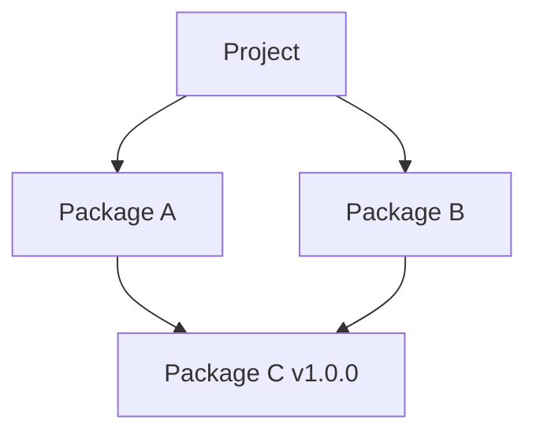

# 06_package_lock: Dependency Trees and Lockfiles

In this lesson, we will dive deep into how npm manages nested dependencies, how it hoists them in `node_modules`, and why **`package-lock.json`** is crucial for team-based development.

---

## 1. Dependency Structure History: Nested vs. Flat

How are dependencies organized inside `node_modules`? 

Suppose your project uses **Package A** and **Package B**. Both of these packages require **Package C**.



### A. The Old Way (npm v1 & v2): Nested Directory Tree
In early versions of npm, packages were installed in a nested tree structure:
```text
my-project/
├── node_modules/
│   ├── Package A/
│   │   └── node_modules/
│   │       └── Package C/ (v1.0.0)
│   └── Package B/
│       └── node_modules/
│           └── Package C/ (v1.0.0)
```
* **Problem**: This resulted in massive duplication of files (multiple copies of Package C). On Windows systems, it frequently caused errors because nested file paths exceeded the operating system's 260-character path limit (`MAX_PATH`).

### B. The Modern Way (npm v3+): Flat / Hoisted Tree
To solve these limitations, modern versions of npm **hoist** transitive dependencies (dependencies of dependencies) up to the root level whenever possible:
```text
my-project/
├── node_modules/
│   ├── Package A/
│   ├── Package B/
│   └── Package C/ (v1.0.0)  <-- Hoisted to the root node_modules
```
If Package A and Package B need different, incompatible versions of Package C, npm will hoist one version to the root and keep the other version nested inside the package that needs it.

---

## 2. The Purpose of `package-lock.json`

Because `package.json` specifies version *ranges* (like `"lodash": "^4.17.21"`, where **Lodash** is a collection of helper functions), the actual version installed could change over time. 

If Developer A runs `npm install` on Monday and gets version `4.17.21`, and Developer B runs `npm install` on Friday after `4.17.22` is released, they will have **different versions** of the code. This is a common source of the "works on my machine" bugs.

To guarantee deterministic, identical builds, npm automatically generates a **`package-lock.json`** file.

### What is inside `package-lock.json`?
Unlike `package.json`, which lists acceptable ranges, `package-lock.json` locks down:
1. The **exact version** of every package installed.
2. The **exact registry URL** the package was fetched from.
3. A **cryptographic integrity hash** (like `sha512`) to verify the downloaded package has not been tampered with or modified.

> [!IMPORTANT]
> You must **never** manually edit `package-lock.json`. It is managed entirely by npm. You should always commit it to your Git repository so that everyone on your team installs the exact same bytes.

---

## 3. `npm install` vs. `npm ci`

Once your project has both files, you have two commands to set up the dependencies:

### `npm install` (The Builder)
* **Behavior**: Reads `package.json` to install dependencies. If a package is missing from `package-lock.json` (e.g., you just added it to `package.json`), npm resolves it, installs it, and updates the lockfile.
* **When to use**: During active development when adding, removing, or updating libraries.

### `npm ci` (The Clean Installer)
* **Behavior**: Deletes the `node_modules` folder completely, then installs the *exact* versions specified in `package-lock.json`. It will **never** modify the lockfile. If `package-lock.json` and `package.json` are out of sync, it will immediately throw an error and fail.
* **When to use**: In Automated CI/CD pipelines, test runners, or when pulling a teammate's changes and setting up the project locally. It is faster and guarantees absolute fidelity.

---

## 4. Verification Exercise

We have provided a mock `package-lock.json` file in this folder along with a verification script `lock_verifier.js`. It parses the mock lockfile to demonstrate how npm locks packages, their exact versions, and their SHA signatures.

To run:
```bash
# If you are in the workspace root directory:
node lock_verifier.js

# Or, if you have navigated inside this folder:
node lock_verifier.js
```
Follow the step-by-step instructions printed in your terminal.
